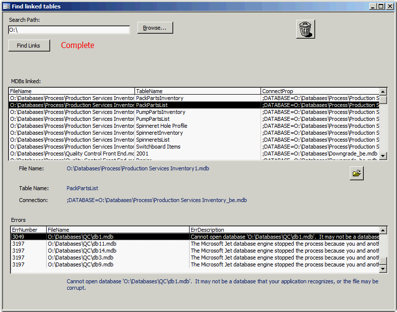



## Find linked tables in other Access mdbs

### Description

This is an Access mdb (in Access 2000 format) that searches a directory path for all mdbs with linked tables.

There is a two-step process:

1) After selecting the search path, the code searches through all subdirectories building a collection of found mdbs.

2) The collection of found files is opened and each table in the mdb's TableDef collection (yes, this uses DAO, not ADO) is checked for the Connect property. If a value is found, it is added to the list box.

In the event there is an error (the mdb cannot be opened, the version is incompatible, etc), the error is noted and the file can be checked later.
 
### More Info
 
This applet only looks for linked tables; it does not change the links.

Additionally, this searches for hard links only, not search through any links made in the code.

None that are obvious.

             |
---                |---
**Submitted On**   |2009-09-28 16:50:02
**By**             |[Andy\_in\_nc](https://github.com/Planet-Source-Code/PSCIndex/blob/master/ByAuthor/andy-in-nc.md)
**Level**          |Intermediate
**User Rating**    |5.0 (10 globes from 2 users)
**Compatibility**  |VBA MS Access
**Category**       |[Databases/ Data Access/ DAO/ ADO](https://github.com/Planet-Source-Code/PSCIndex/blob/master/ByCategory/databases-data-access-dao-ado__1-6.md)
**World**          |[Visual Basic](https://github.com/Planet-Source-Code/PSCIndex/blob/master/ByWorld/visual-basic.md)
**Archive File**   |[Find\_linke2164101022009\.zip](https://github.com/Planet-Source-Code/andy-in-nc-find-linked-tables-in-other-access-mdbs__1-72509/archive/master.zip)

